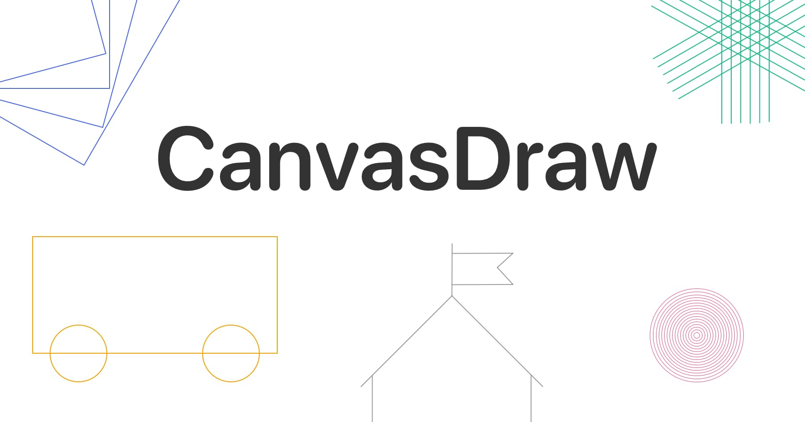
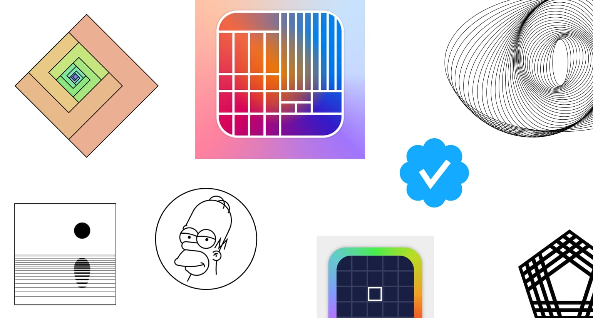

<div align="center" style="display:flex;flex-direction:column;padding-bottom:3rem">
  <a href="https://canvasdraw.limboy.me">
    
  </a>
  <h3> Draw with code </h3>
</div>



### Try it now
Go to https://canvasdraw.limboy.me to start drawing.

draw API can be found [here](./packages/canvaslib/README.md).

> **Note**
> 
> after a snippet is shared, add `.png` suffix will get you an image of that snippet
>
> ie: https://canvasdraw.limboy.me/snippet/ZL7pyCWi1Tq.png
>
> you can even add query string to that url, and handle in snippet using `payload.uri`

### Installation
#### Requirements
- [Node.js](https://nodejs.org/)
- [pnpm](https://pnpm.io/)

#### Clone the repo

```
git clone https://github.com/limboy/canvasdraw.git
```

#### Install the dependencies

```
pnpm install
```

#### Start the server

```
pnpm build
pnpm dev
```

open http://localhost:3727 and start drawing.

